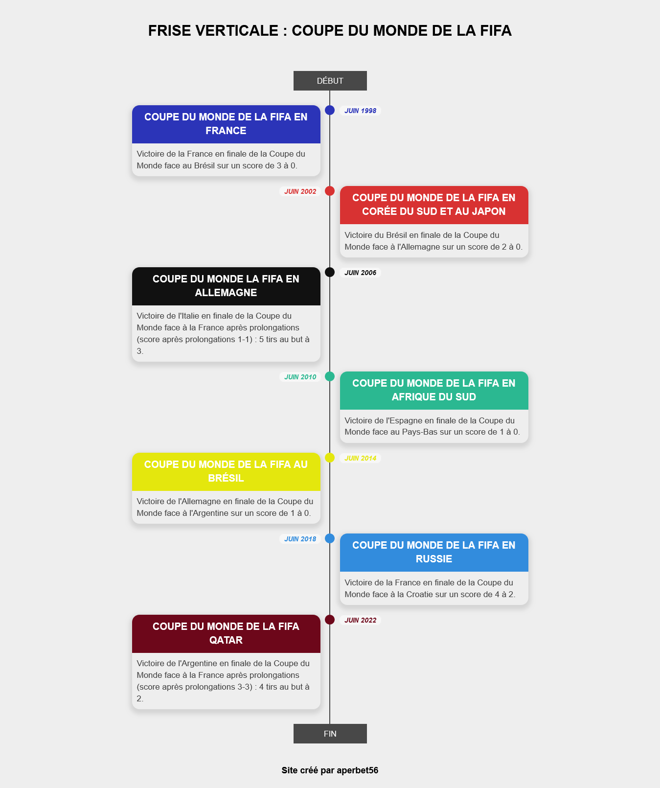

## FRISE VERTICALE : COUPE DU MONDE DE LA FIFA

## Le challenge

J'ai voulu créé une frise verticale qui indique les sept derniers vainqueurs de la coupe du monde de la FIFA ainsi que le pays organisateur. Cette frise apparaît de manière progresssive.
De plus, la page web est reponsive. En effet, cette frise verticale présente une répartition gauche-droite en mode desktop/tablette et un bloc en mode mobile.

## Démonstration

Lien vers le projet : https://aperbet56.github.io/timeline_verticale/

## Développez avec

- Utilisation des balises sémantiques HTML5
- CSS
- Flexbox
- Pseudo-éléments
- Animation CSS pour une apparition progressive des articles
- Animation-delay sur chaque article
- Page web responsive
- Desktop first
